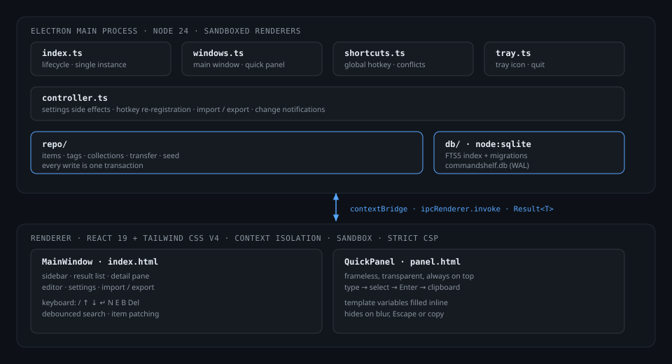
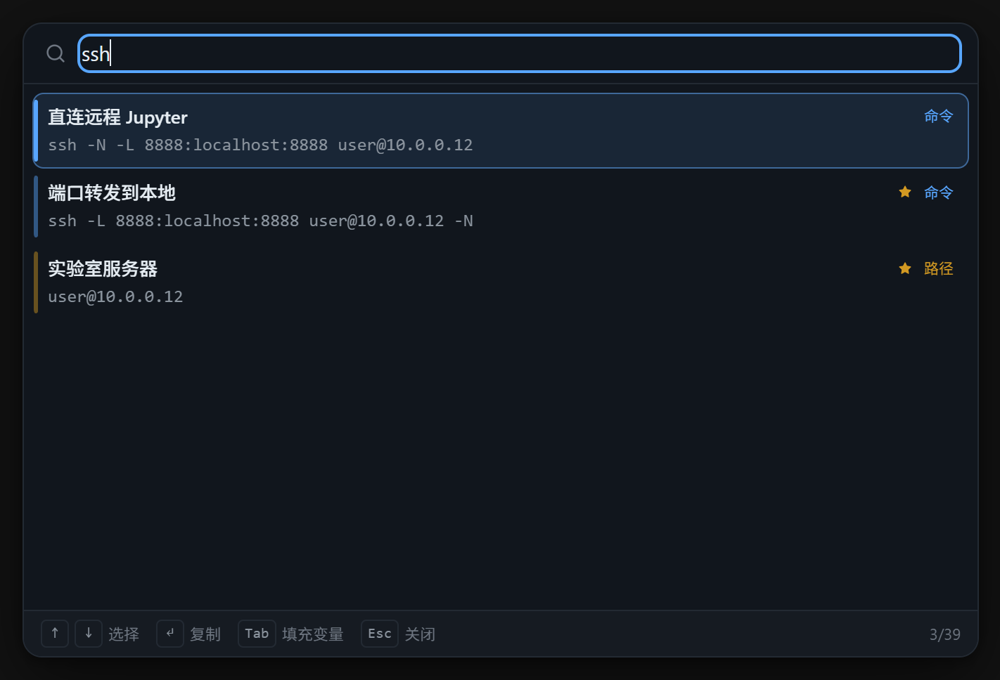
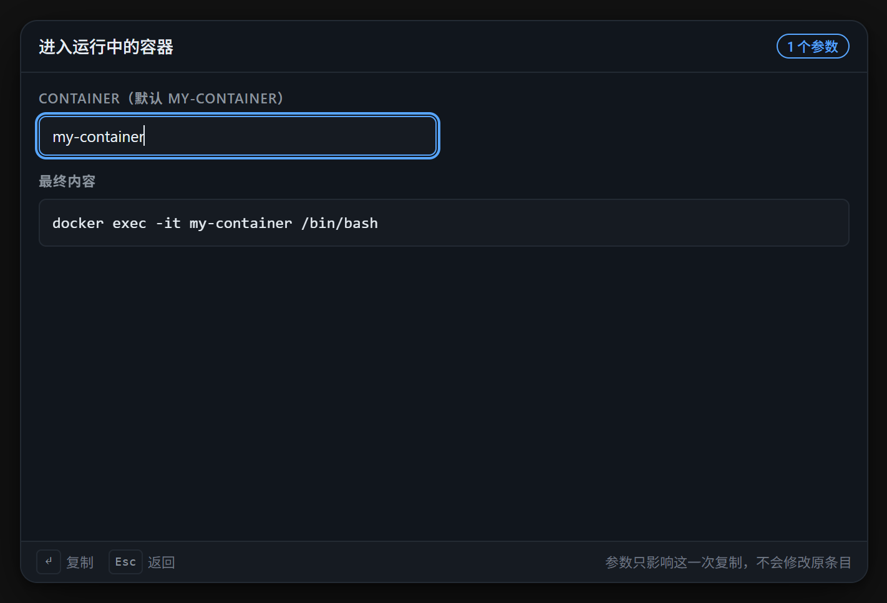
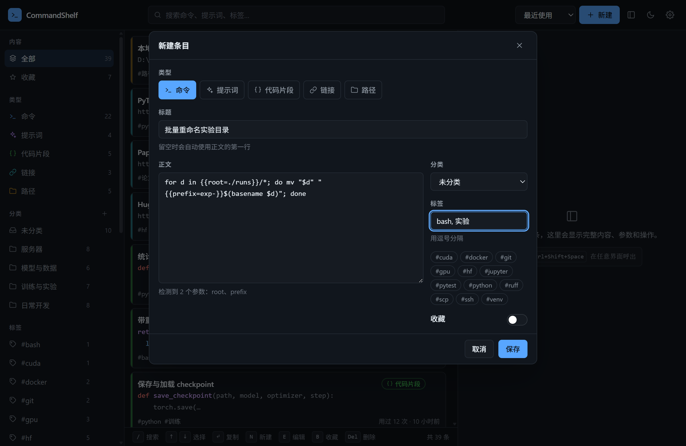
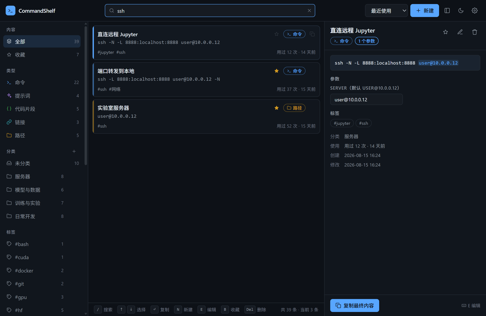
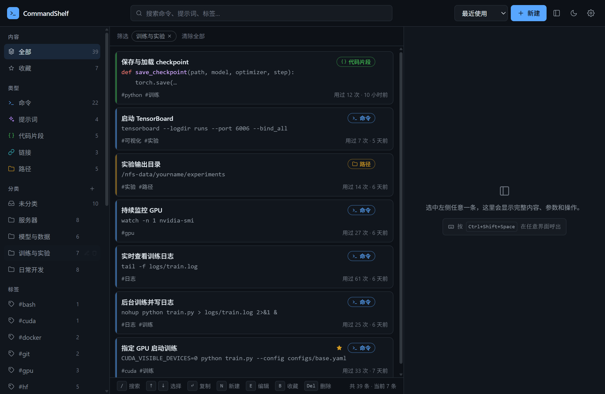
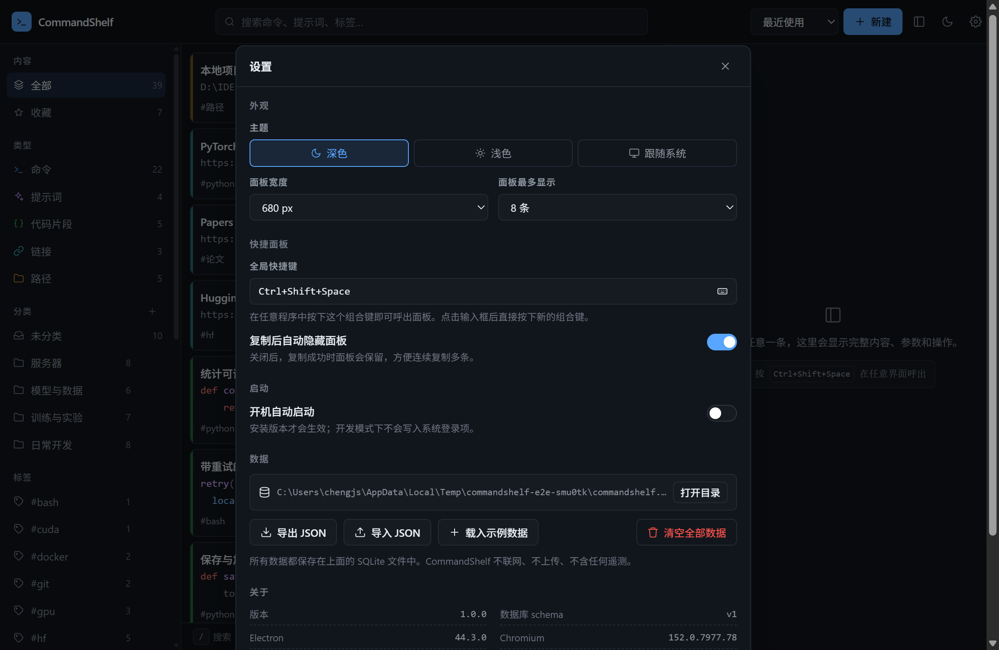

<div align="center">

# CommandShelf

**你的命令、提示词和代码片段，三秒之内拿到手。**

一个用来收拢"反复重敲的命令"和"反复重写的提示词"的 Electron 工作台。

[](https://www.electronjs.org/)
[](https://react.dev/)
[](https://www.typescriptlang.org/)
[](https://nodejs.org/api/sqlite.html)
[](LICENSE)
[](tests)
[](#隐私)

[English](README.md) · **中文**

</div>


在任何界面按下 <kbd>Ctrl</kbd>+<kbd>Shift</kbd>+<kbd>Space</kbd>，输入两三个字母，按下
<kbd>Enter</kbd>。内容已经在剪贴板上，面板消失，焦点回到你原本工作的窗口。

这一来一回，就是整个项目存在的理由。侧边栏、标签、分类、编辑器，都是为了让这一来一回里
有值得拿的东西。

---

## 它解决什么问题

你真正需要的那些命令，散落在这些地方：

```text
ChatGPT 的历史对话 · 终端历史（已经翻走了） · 某个 README
桌面上一个没保存完的 commands.txt · VS Code 里一个从没存过的标签页
微信收藏 · 浏览器书签
```

`ssh -L ...`、`hf download ...`、`CUDA_VISIBLE_DEVICES=0 ...`、花了二十分钟才调对的提示词、
数据集的路径、论文的 URL。它们都不机密，都高频，却都不在你两秒内能拿到的地方。

CommandShelf 就是一个本地 SQLite 文件，外加一个全局热键。

## 它和笔记软件的区别

**它是围绕"取用"设计的，不是围绕"记录"。** 一个需要用
`切窗口 → 点搜索 → 输入 → 找到 → 点复制 → 切回去 → 粘贴`
的片段管理器，并不比翻终端历史快，你会在一个星期内放弃它。快捷面板才是主界面，
主窗口只是用来整理的地方。

**模板变量是一等公民。** 写在 `{{花括号}}` 里的部分会在复制前变成待填字段，默认值已经
填好，因此一条记录可以覆盖你用它时的每一台服务器、每一个端口、每一条路径：

```bash
ssh -L {{local_port=8888}}:localhost:{{remote_port=8888}} {{server=user@10.0.0.12}} -N
```

**搜索理解你真正输入的东西。** 英文查询走 SQLite FTS5 前缀匹配并用 bm25 排序；含中文的
查询回退到子串匹配，因为 FTS5 的 `unicode61` 分词器不会切分中文词。标题、正文、标签、
分类名都在检索范围内。

**它刻意保持小。** 没有同步、没有账号、没有内嵌终端、没有 Markdown 笔记、没有剪贴板历史、
没有"AI 助手"。判断一个功能该不该做的标准只有一条：它让"找到并拿走一条内容"变快了，还是
变慢了。

## 功能

### 快捷面板

- 全局热键（默认 <kbd>Ctrl</kbd>+<kbd>Shift</kbd>+<kbd>Space</kbd>，可在设置中修改）。
- 无边框、置顶、出现在鼠标所在的那块屏幕上。
- 输入即搜，<kbd>↑</kbd><kbd>↓</kbd> 选择，<kbd>Enter</kbd> 复制并关闭。
- <kbd>Esc</kbd> 或点击别处关闭，复制后自动关闭。
- 含参数的内容会先展开填写表单，并实时预览最终文本。
- 每次呼出都是干净状态，不保留上次的输入。

### 查找

- 搜索标题、正文、标签和分类名。
- 按类型、分类、标签筛选，或只看收藏。
- 按最近使用、最近创建、最近修改、使用次数、标题排序。
- 全程可只用键盘：<kbd>/</kbd> 搜索、<kbd>↑</kbd><kbd>↓</kbd> 选择、<kbd>Enter</kbd> 复制、
  <kbd>N</kbd> 新建、<kbd>E</kbd> 编辑、<kbd>B</kbd> 收藏、<kbd>Del</kbd> 删除。

### 后台常驻与开机启动

- 关闭窗口不会退出，应用留在托盘里，全局热键继续可用；退出要从托盘菜单显式操作。
- 「开机自动启动」会把已安装的应用注册到系统（Windows 上是 `Run` 注册表项），并且**静默启动到托盘**——不会每次开机都弹一个窗口，只留热键可用。
- 每次启动都会重写这条注册，因为它记录的是可执行文件的路径；换了安装位置以后旧记录会指向一个不存在的文件。
- 设置里显示的是**系统真实注册状态**，所以开关不会出现「显示已开启但实际没注册」的情况。开发模式下会被跳过（此时可执行文件是 Electron 开发程序而不是应用本身），Linux 上 Electron 不支持该能力——两种情况都会明确说明。

### 整理

- 五种类型：命令、提示词、代码片段、链接、路径，各有自己的颜色、图标和默认动作。
- 分类（每条一个）与标签（每条多个），支持重命名、合并、删除。
- 删除分类不会删除其中的内容，条目只是变成未分类；删除标签只解除关联。
- 删除条目会弹出可撤销的提示。

### 你的数据

- 一个 SQLite 文件，WAL 模式，路径在设置里可见，并提供"打开目录"。
- 导出为可读的 JSON（分类与标签按**名字**导出，换一台机器也能导入）。
- 导入时自动跳过重复内容。
- 版本升级走显式、叠加式的 schema 迁移，绝不重建表。
- 不联网、无遥测、无账号。

## 键盘操作

| 位置     | 按键                                                                       | 作用                         |
| -------- | -------------------------------------------------------------------------- | ---------------------------- |
| 任意界面 | <kbd>Ctrl</kbd>+<kbd>Shift</kbd>+<kbd>Space</kbd>                          | 呼出 / 收起快捷面板          |
| 快捷面板 | <kbd>↑</kbd> <kbd>↓</kbd>                                                  | 移动选择                     |
| 快捷面板 | <kbd>Enter</kbd>                                                           | 复制（或展开参数表单）并关闭 |
| 快捷面板 | <kbd>Tab</kbd>                                                             | 为选中项展开参数表单         |
| 快捷面板 | <kbd>Esc</kbd>                                                             | 返回搜索，再按一次关闭       |
| 主窗口   | <kbd>Ctrl</kbd>+<kbd>K</kbd> / <kbd>Ctrl</kbd>+<kbd>F</kbd> / <kbd>/</kbd> | 聚焦搜索框                   |
| 主窗口   | <kbd>↑</kbd> <kbd>↓</kbd>                                                  | 移动选择（在搜索框里也生效） |
| 主窗口   | <kbd>Enter</kbd>                                                           | 复制选中项                   |
| 主窗口   | <kbd>N</kbd> / <kbd>E</kbd> / <kbd>B</kbd> / <kbd>Del</kbd>                | 新建 / 编辑 / 收藏 / 删除    |
| 主窗口   | <kbd>Esc</kbd>                                                             | 清空搜索，再按一次清空选择   |

文本框获得焦点时单字母快捷键不生效，因此输入查询词不会误触发它们。

## 安装

CommandShelf 通过 GitHub Release 分发，不通过包管理器：
**[下载最新版本](https://github.com/Galaxy-Chjs/CommandShelf/releases/latest)**。

```bash
# Windows —— 安装版或免安装版
CommandShelf-1.0.0-win-x64.exe
CommandShelf-1.0.0-portable.exe

# Linux —— AppImage 或 .deb
CommandShelf-1.0.0-linux-x86_64.AppImage
CommandShelf-1.0.0-linux-amd64.deb

# macOS
CommandShelf-1.0.0-mac-x64.dmg
```

免安装版不需要安装：直接运行，数据库同样保存在用户目录下。

> 产物由 [`.github/workflows/release.yml`](.github/workflows/release.yml) 构建，**未做代码签名**，
> 因此 Windows SmartScreen 与 macOS Gatekeeper 会在首次启动时提示。

### 从源码运行

```bash
git clone https://github.com/Galaxy-Chjs/CommandShelf
cd CommandShelf
npm install
npm run dev          # 开发模式，两个窗口都热更新
npm run build        # 产物输出到 out/
npm run dist:win     # 安装包输出到 release/
```

需要 Node.js 22.5 或更高版本——应用使用内置的 `node:sqlite`，没有任何需要编译的原生依赖。

## 架构



两个渲染层（主窗口与快捷面板）通过类型化的 IPC 桥接与同一个主进程通信。所有需要权限的
事情都由主进程负责：SQLite 连接、全局热键、托盘、剪贴板、文件对话框和 shell。

```text
src/main/       Node 侧：生命周期、窗口、托盘、热键、SQLite、仓库层
src/preload/    渲染层可以做的事情的完整清单
src/renderer/   React：两个入口 + 共用组件库
src/shared/     两端共用的类型与纯逻辑
```

几个关键决定：

- **用 `node:sqlite` 而不是 `better-sqlite3`。** 原生模块需要针对 Electron 的 ABI 重新编译，
  在 Windows 上需要 Visual Studio Build Tools，打包时还需要 asar unpack。Electron 44 内置
  的 Node 24 自带带 FTS5 的 SQLite，因此本项目零原生依赖。
- **渲染层通过自定义的 `app://` scheme 提供。** 用 `file://` 加载会让文档拿到不透明的
  origin，于是 `Content-Security-Policy: script-src 'self'` 匹配不到任何东西，静默地阻止
  应用自己的 bundle。特权 scheme 给了它真实 origin，CSP 才真正生效。
- **每个 IPC 调用返回 `Result` 信封。** Electron 会把 handler 里抛出的错误替换成
  `"Error invoking remote method ..."`，界面需要的消息就此丢失。
- **`transact` 通过 savepoint 支持嵌套。** 自带事务的仓库函数被另一个事务调用也是安全的。

完整说明见 [`docs/architecture.md`](docs/architecture.md)。

## 截图

| 快捷面板                           | 填写参数                                 |
| ---------------------------------- | ---------------------------------------- |
|  |  |

| 编辑条目                          | 浅色主题                            |
| --------------------------------- | ----------------------------------- |
|  |  |

| 按分类浏览                           | 设置                              |
| ------------------------------------ | --------------------------------- |
|  |  |

所有截图都是运行中的真实界面（含内置示例数据），由
[`tests/e2e/screenshots.spec.ts`](tests/e2e/screenshots.spec.ts) 以 2 倍缩放生成。

## 开发

```bash
npm run dev            # Electron + Vite，两个渲染层热更新
npm run typecheck      # 三个 TypeScript 工程：main、renderer、e2e
npm run lint
npm test               # 250 个单元与组件测试
npm run e2e            # 56 个端到端测试，驱动真实应用
npm run screenshots    # 重新生成 docs/images（会写入仓库）
npm run test:coverage
npm run icons          # 重新生成图标（纯 Node，无图像依赖）
```

端到端测试通过 Playwright 驱动真实的 Electron 二进制。有两点值得知道：每次启动都会分配一个
临时的 `userData` 目录，因此测试永远不会碰到你的真实数据库；同时会先从环境变量中删除
`ELECTRON_RUN_AS_NODE`——这个变量一旦存在，Electron 会以普通 Node 启动，应用根本不会起来。

## 技术栈

| 层       | 选型                                            |
| -------- | ----------------------------------------------- |
| 桌面外壳 | Electron 44                                     |
| 界面     | React 19、TypeScript 5.9、Tailwind CSS v4       |
| 构建     | electron-vite、Vite 7、electron-builder         |
| 存储     | `node:sqlite`（SQLite + FTS5）                  |
| 高亮     | highlight.js，只注册这里真正用得到的语言        |
| 测试     | Vitest、Testing Library、Playwright（Electron） |

## 隐私

CommandShelf 不发起任何网络请求。没有更新器、没有统计、没有崩溃上报、没有账号。
所有数据都在磁盘上的一个 SQLite 文件里，路径在设置中可见。

## 路线图

**不打算做。** 云同步、账号、协作、内嵌终端、剪贴板历史、Markdown 笔记系统、
AI 生成内容、插件系统。这个工具的价值就在于它小到可以被一个热键信任。

**将来可能做。** 具名变量组（一套"服务器"预设一次填好几个字段）、导入 shell 历史、
使用统计，以及一个共用同一数据库的 VSCode 扩展。

## 许可

[MIT](LICENSE)
